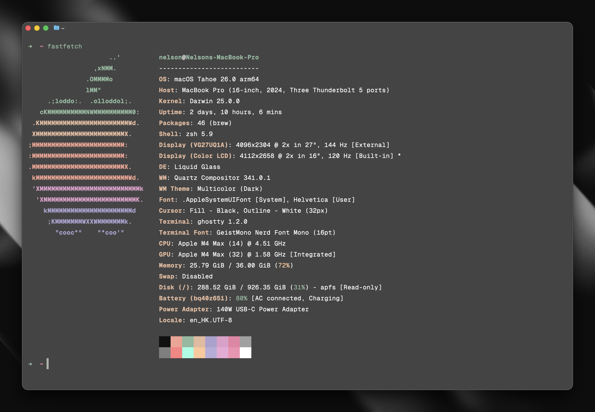

<p align="center">
  
  <h1 align="center">Dotfiles</h1>
</p>

Personal configuration files for my development environment. The configurations are managed using GNU Stow for easy symlinking and organization.

> [!WARNING]
> The configuration is for my personal use and may not work for you. Please review the files before applying them to your system.



## Contents

- `.config/`
  - `ghossty/` - Terminal emulator settings
  - `karabiner/` - Keyboard customization (macOS)
- `.ssh/` - SSH configuration
- `.gitconfig` - Git configuration with GPG signing
- `.zshrc` - Shell configuration with oh-my-zsh
- `.zshenv` - Environment variables
- `Brewfile` - Homebrew package list

## Installation

1. Install GNU Stow:

```bash
brew install stow
```

2. Clone and apply:

```bash
git clone https://github.com/nelsonlaidev/dotfiles.git ~/dotfiles
cd ~/dotfiles
stow .
```
