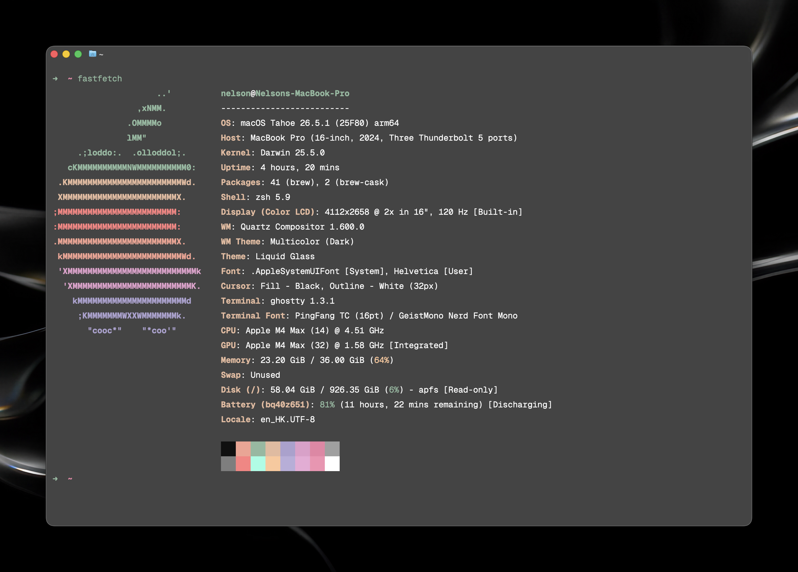

<p align="center">
  
  <h1 align="center">Dotfiles</h1>
</p>

Personal configuration files for my development environment. The configurations are managed using GNU Stow for easy symlinking and organization.

> [!WARNING]
> The configuration is for my personal use and may not work for you. Please review the files before applying them to your system.



## Contents

- `.config/`
  - `1Password/` - SSH agent config (Developer vault)
  - `ghostty/` - GPU-accelerated terminal emulator (GeistMono Nerd Font, vesper theme, 70% opacity)
  - `karabiner/` - Keyboard customization for Cantonese input (UIO/JKL swap)
  - `mise/` - Runtime version manager (Node 26, pnpm 11.8)
- `.ssh/` - SSH client config (1Password agent, OrbStack)
- `.gitconfig` - Git config with SSH commit signing via 1Password
- `.zshrc` - Zsh config (Oh My Zsh, zoxide, eza, mise, 1Password agent)
- `.zshenv` - Environment variables (Rust, Homebrew, Bun, fnm)
- `.stowrc` - Stow target (`~/`)
- `.stow-local-ignore` - Files excluded from stow symlinking
- `Brewfile` - Homebrew bundle (formulae and casks)

## Installation

```bash
brew install stow
git clone git@github.com:nelsonlaidev/dotfiles.git ~/dotfiles
cd ~/dotfiles
stow .
```
